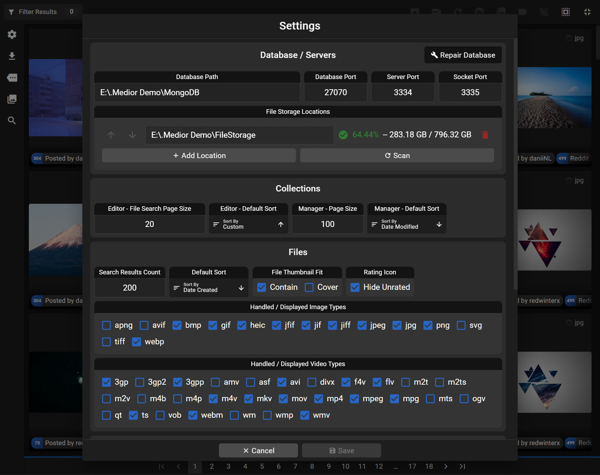

  

  <ul align="center" style="list-style: none;">
    

      <h1>Medior</h1>
    

  </ul>

  <i>The tag-based local media management system</i>

  <h3>Features</h3>

* Portable offline database with support for distributed file storages
* Hierarchical (parent / child) tagging system with aliases and regular expressions
* Drag-and-drop to import entire file structures
    * Tag parsing and generation from folders, file names, and AI diffusion parameters
    * Thumbnail generation with hoverable animations
    * Deduplication and blacklist of previously deleted files
    * File collections from folders
    * Optional remuxing to mp4 for seamless playback
* Bulk editing and organization of files, tags, collections, and import batches
* Comprehensive search and sort filters backed by a database designed and optimized for large scale personal file systems
* File collections / ordered albums (one file—many tags—many collections)
* Media carousel with seamless custom image viewer and video player
    * Hotkeys for quickly rating, deleting, or tagging file sequences
    * Transcoding for non-web formats
    * Frame-by-frame and time seeking hotkeys
    * Frame extraction
    * A/B looping
    * Zoom, pan, and aspect ratio lock
* AI image diffusion info-text parsing and filtering
* AI facial recognition

  <h3>Screenshots (v.2.7.0)</h3>

  <i>Contact medior.app@proton.me for inquiries and bug reports</i>

