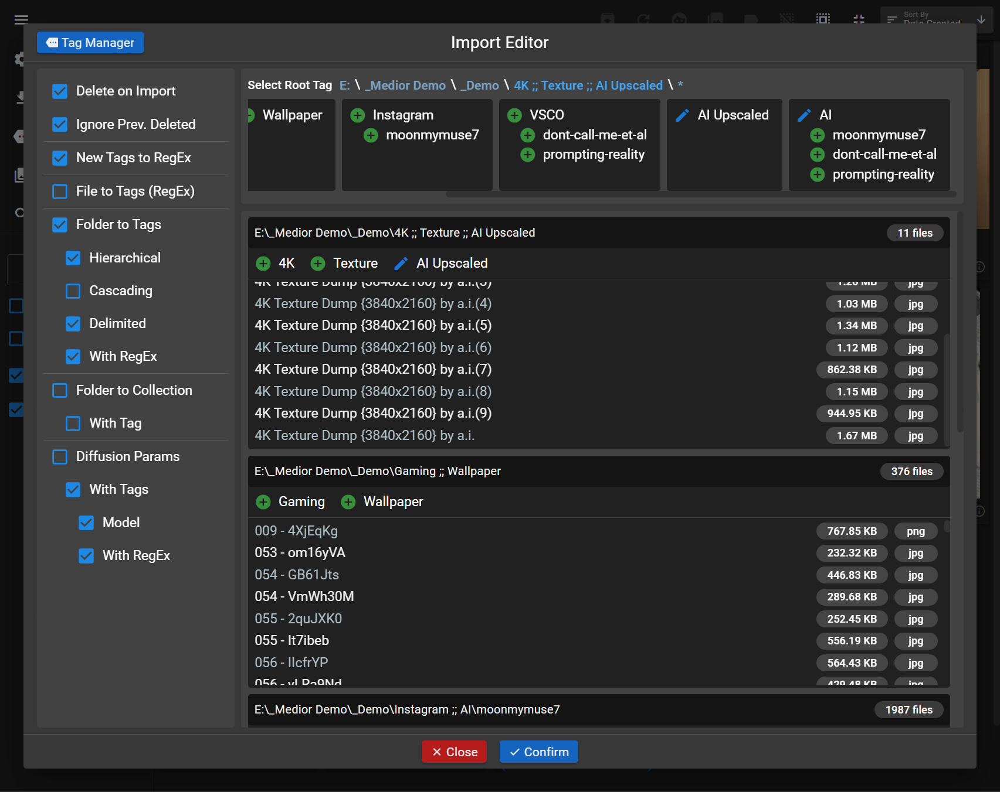
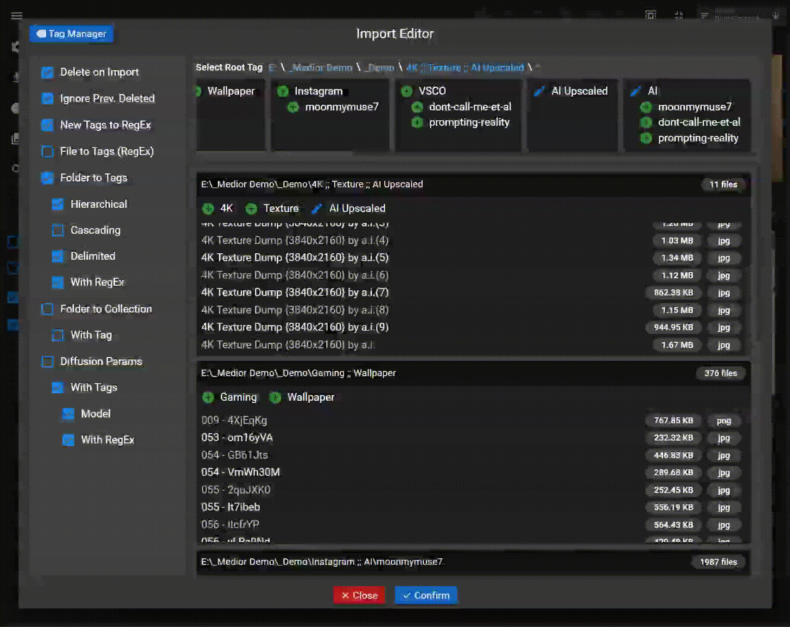
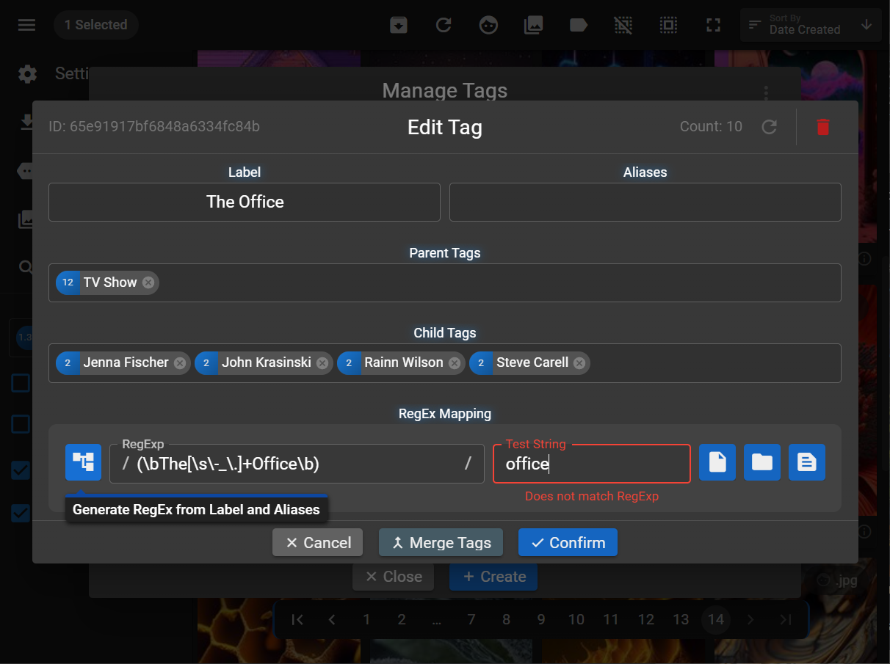
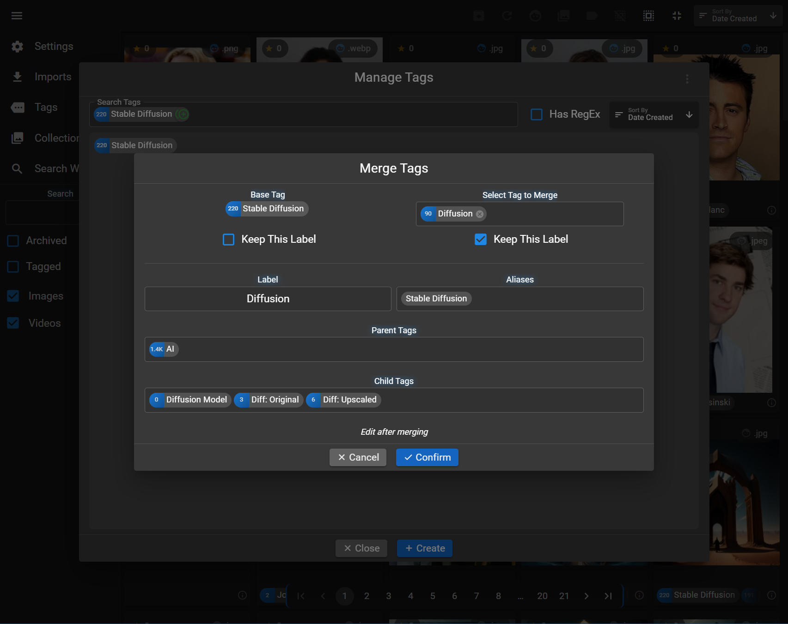
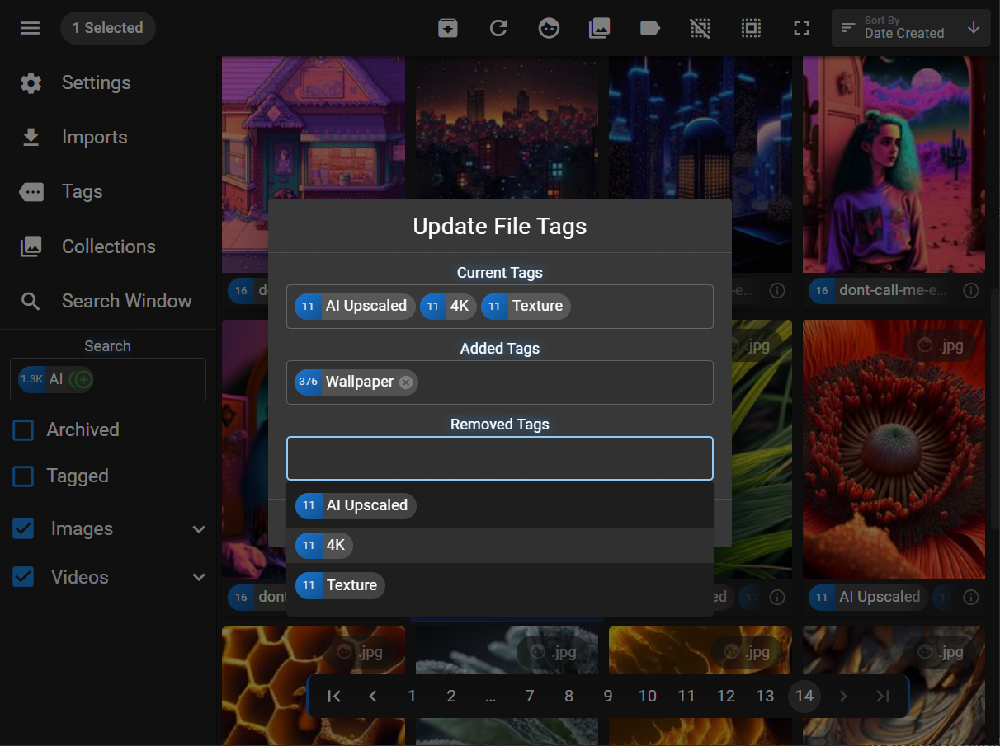
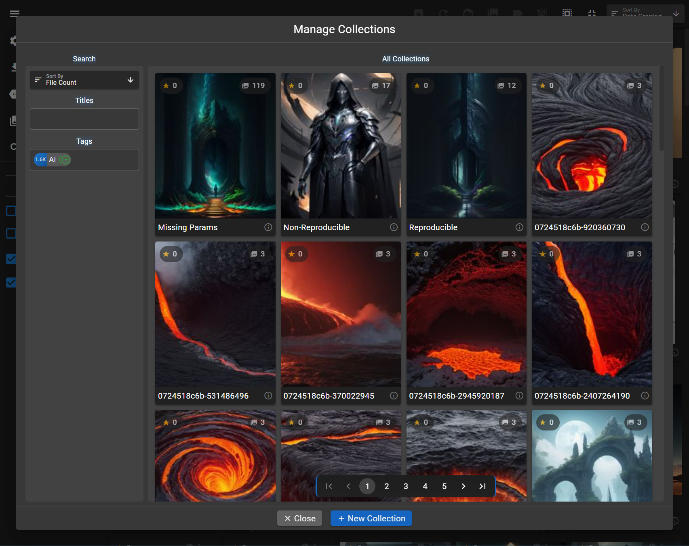
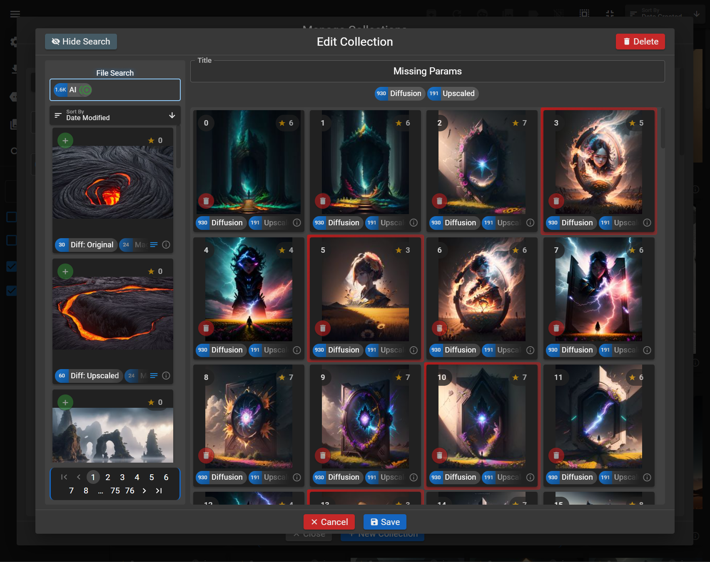
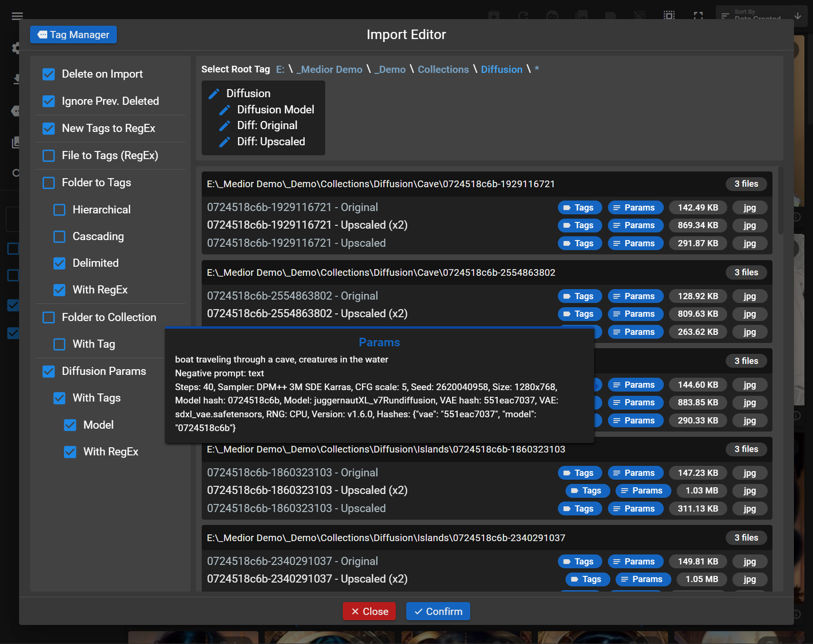
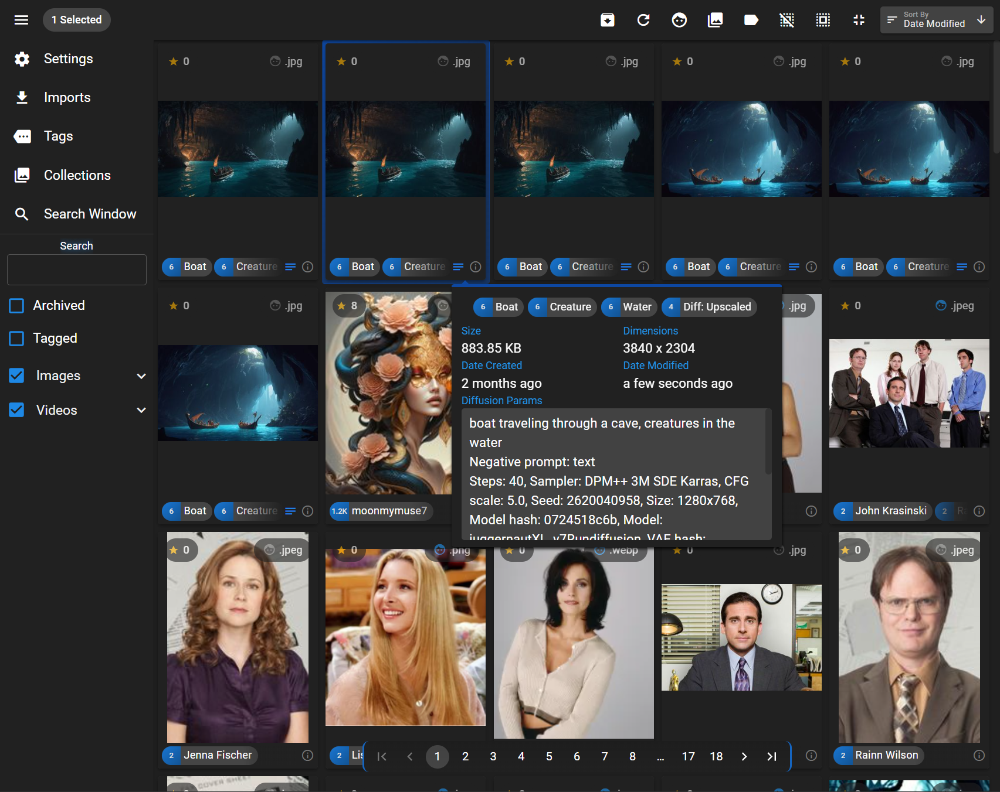
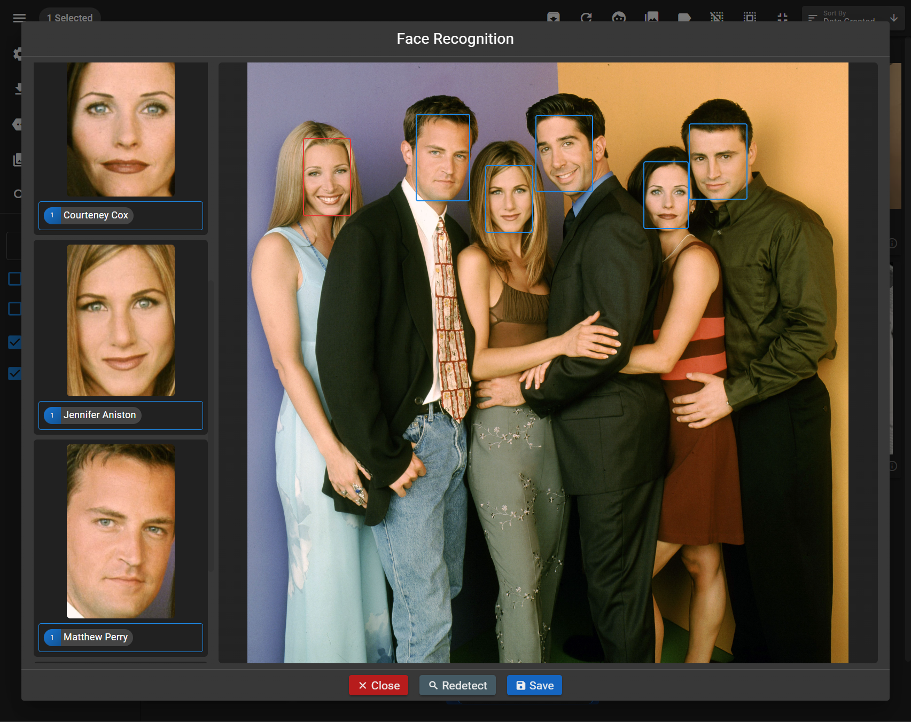

  
  <h1>Medior</h1>

  

  An offline desktop app for managing mass media in a portable database.
  

  
Features a hierarchical tagging system with comprehensive search and sorting, automated tag creation / parsing from multiple sources, batch editing and organization, collections / albums, AI facial recognition, Stable Diffusion integration, and built-in media viewers.
  

  <h2>Screenshots</h2>

  
Import and export files and folders via drag-and-drop.

  

    
  

 

  
Parse folder paths, file names, and matching text files on import to automatically create hierarchical tags, collections, and diffusion params.

  

    
    
  

 

  
Edit tag aliases, hierarchical relationships, and RegEx mappings for import parsing, or merge tags together.

  

    
    
  

 

  
Quickly edit file tags or ratings via hotkeys in home, search, and carousel windows.

  

    
  

 

  
Create file collections with searchable titles and tags and manual ordering of files.

  

    
    
  

 

  
Carousel window with custom media viewer support for all supported file types.

  

    
    
  

 

  
Import Stable Diffusion generation parameters from text files and parse prompts and models into tags.

  

    
    
  

 

  
Build your own database of faces starting from only one image per person to automatically tag images via AI facial recognition.

  

    
  

